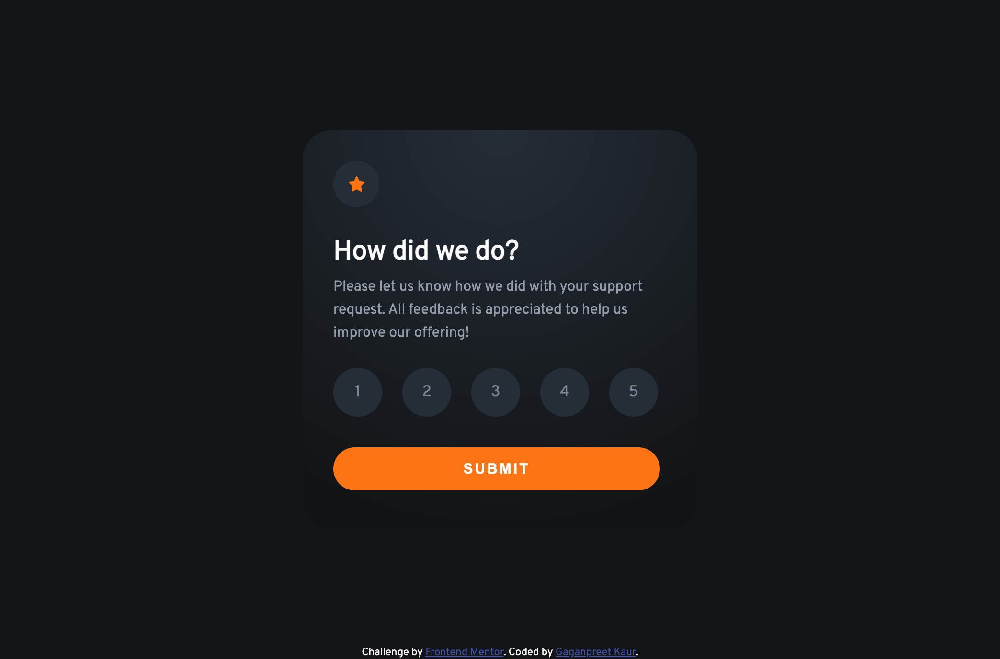
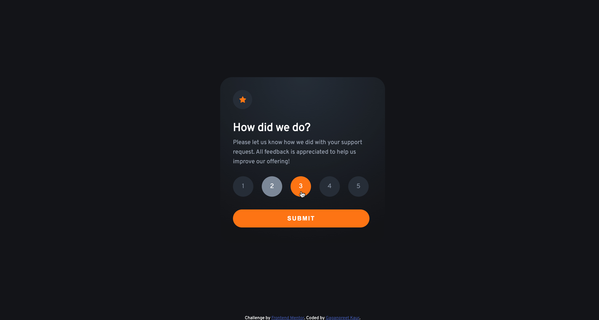
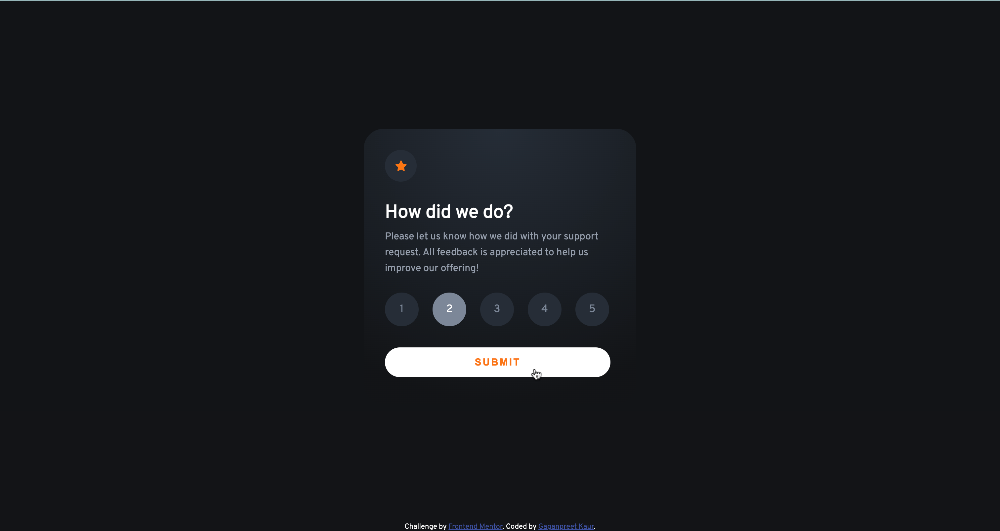
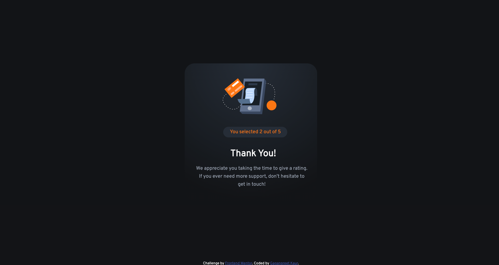
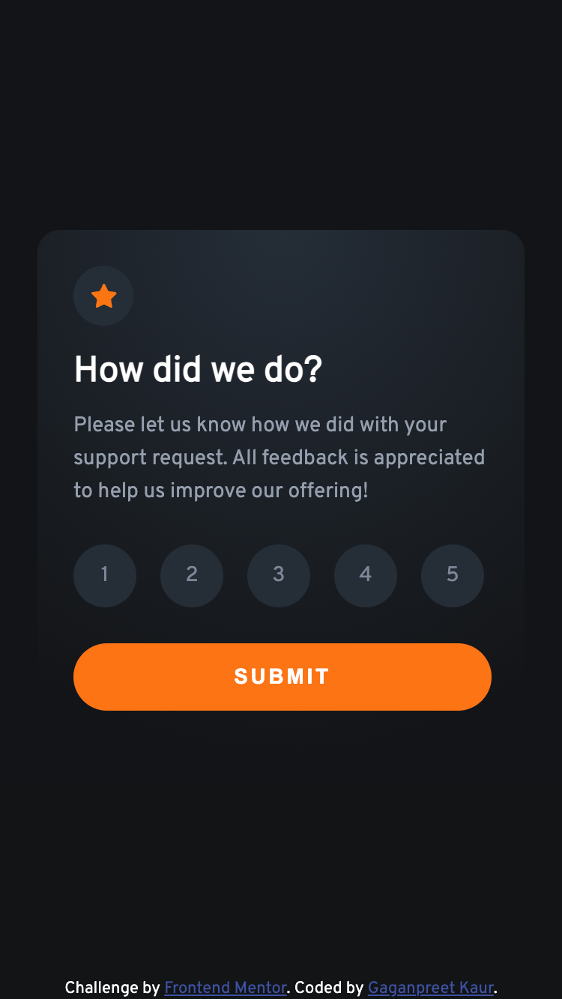
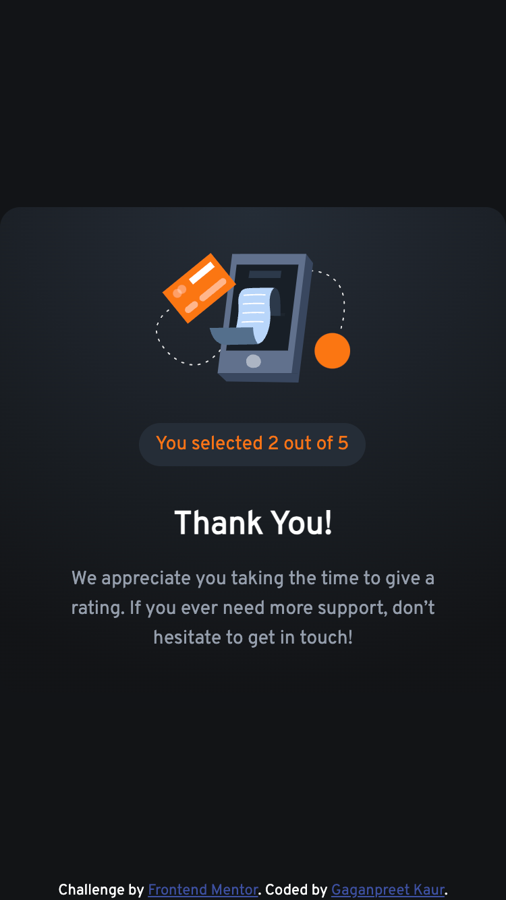

# Frontend Mentor - Interactive rating component solution

This is a solution to the [Interactive rating component challenge on Frontend Mentor](https://www.frontendmentor.io/challenges/interactive-rating-component-koxpeBUmI). Frontend Mentor challenges help you improve your coding skills by building realistic projects. 

## Table of contents

- [Overview](#overview)
  - [The challenge](#the-challenge)
  - [Screenshot](#screenshot)
  - [Links](#links)
- [My process](#my-process)
  - [Built with](#built-with)
  - [What I learned](#what-i-learned)
  - [Continued development](#continued-development)
  - [Useful resources](#useful-resources)
- [Author](#author)


## Overview

The "interactive rating component" is a responsive webpage which allows the user to submit the rating given by them and display it. To make this webpage, HTML, CSS and Javascript has been used.

### The challenge

Users should be able to:

- View the optimal layout for the app depending on their device's screen size
- See hover states for all interactive elements on the page
- Select and submit a number rating
- See the "Thank you" card state after submitting a rating

### Screenshot

**Desktop View**


**Desktop List Interactive View**


**Desktop Button Interactive View**


**Desktop Thanks View**


**Mobile View**


**Mobile Thanks View**



### Links

- Solution URL: [Add solution URL here](https://your-solution-url.com)
- Live Site URL: [Add live site URL here](https://your-live-site-url.com)

## My process

In this example, I have divided the design into two pages i.e. index and result. First, the code, design and logic for the first page is established then the second page has been created.

To make the proccess easier, initially in the result.html, I have just one p tag to display the content of list item. It ease out the process of creating designing afterwards. I have also used console.log statments to verify in the inspect that the list item is getting parsed correctly. So, if you are using the code, it is highlt recommended to check these outputs in console of inspect element in developer tools. It will really help you to improve the logic.

### Built with

- Semantic HTML5 markup
- CSS custom properties
- Flexbox
- Mobile-first workflow
- Vanilla JavaScript

### What I learned

This challenge helps me to understand the toggle function in JS. The class has been redefined for the list item using this function. The code is explained in the file using comments.

```javascript
    element.classList.toggle("FinishTask");
``````

Parsing the value to different page was bit challenging for me. however, it helps me to brush my knowledge regarding DOM manipulation in a better manner.

### Continued development

I would consider to develop such challenges as it improves the core knowledge of the programming language.

### Useful resources

- [Resource 1](https://stackoverflow.com/questions/73187216/changing-the-classname-of-the-specific-li-that-is-clicked-on) - This helped me to toggle the class for  the list item and change the properties. 

## Author

- Frontend Mentor - [@GaganpreetKaurGill](https://www.frontendmentor.io/profile/GaganpreetKaurGill)


