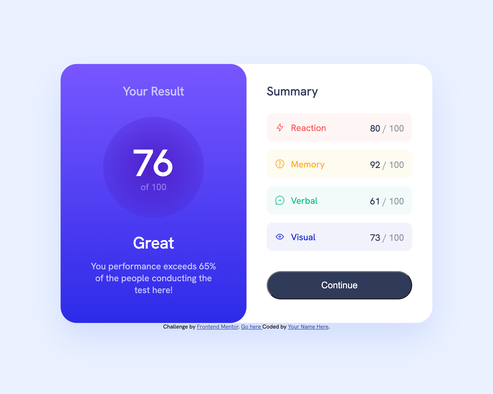
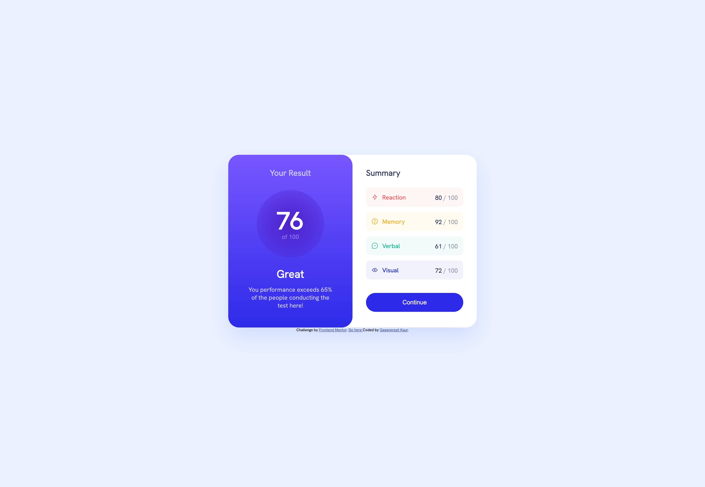
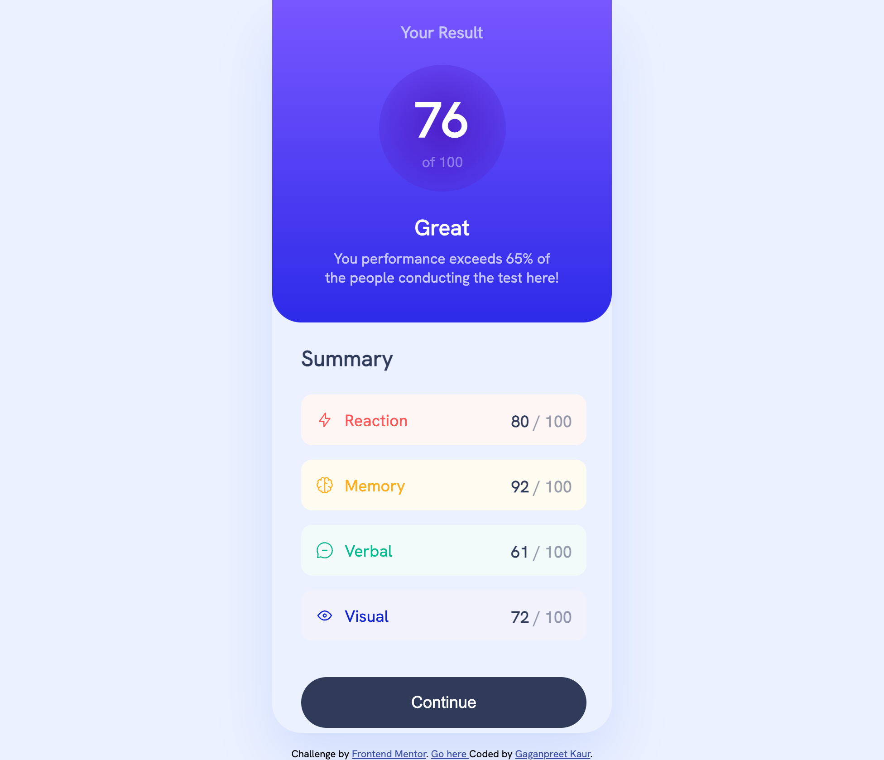

# Frontend Mentor - Results summary component solution

This is a solution to the [Results summary component challenge on Frontend Mentor](https://www.frontendmentor.io/challenges/results-summary-component-CE_K6s0maV). Frontend Mentor challenges help you improve your coding skills by building realistic projects. 

## Table of contents

- [Overview](#overview)
  - [The challenge](#the-challenge)
  - [Screenshot](#screenshot)
  - [Links](#links)
- [My process](#my-process)
  - [Built with](#built-with)
  - [What I learned](#what-i-learned)
  - [Continued development](#continued-development)
  - [Useful resources](#useful-resources)
- [Author](#author)
- [Acknowledgments](#acknowledgments)

## Overview
This challenge includes the JSON data and it is renderend using JavaScript and displayed in the HTML output. the script tag is used to incude the JavaScript

### The challenge
The major challenge in this was to render the correct and calculate the average result of the Score in the JSON file.

### Screenshot

**Desktop screenshot**


**Active State**


**Mobile Device**


### Links

- Solution URL: [Add solution URL here](https://your-solution-url.com)
- Live Site URL: [Add live site URL here](https://your-live-site-url.com)

## My process

I divided the main section into left and right. First, I finished the HTML & CSS for left section. Then, for the right section.

To ease the process, I first finished the static page not including any JS into the code. It helped me a lot to finish the design process faster. Then after settling down all the elements and choosing the tags I wanted to display the JASON value into, I included the JavaScript code.

### Built with

- Semantic HTML5 markup
- CSS custom properties
- Flexbox
- Mobile-first workflow
- Vanilla JavaScript

### What I learned

Well, I learned the functionality of margin-left:auto use in the flexbox. I was having three items in the flex container and I wanted to display the last item to the right. I tried using different flex properties. Then, I found the use of margin-left on Stack Overflow in the flex container. This was something new to me.

```css
.rightsection figure p{
  margin-left: auto;
}
```

### Continued development ###

I want to focus more on the JavaScript side of the coding workflow. I got more involved in the design process. Well, I hope I will put more efforts into JavaScript development.

### Useful resources

- [Resource 1](https://stackoverflow.com/questions/35269947/how-can-i-align-one-item-right-with-flexbox) - I would highly recommend the use of Stack Overflow as there are multiple ways given to solve a problem. We can find the best possible way to solve a problem if we stuck with our approach.
- [Resource 2](https://developer.mozilla.org/en-US/docs/Web/CSS/) - I always keep the documentation open whenever I'm coding. 


## Author

- Frontend Mentor - [@GaganpreetKaurGill](https://www.frontendmentor.io/profile/GaganpreetKaurGill)

